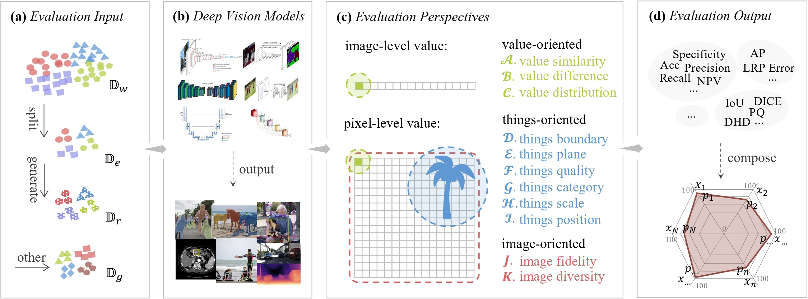

# How Correct Is Your Vision Model? A Comprehensive Survey

Welcome to the official repository for the paper **"How Correct Is Your Vision Model? A Comprehensive Survey"**. This repository contains the experimental code and the comprehensive survey paper associated with our research.

## Overview

In this repository, you will find:
- The experimental code used in our survey.
- The comprehensive survey paper.

## Online Model Evaluation Platform

Based on our survey, we have developed an online model evaluation platform. You can access it at: [model-evaluation.vipazoo.com](http://model-evaluation.vipazoo.com).

## Surveyed Papers

Below is the list of papers we surveyed in our comprehensive study:

### Image-level Discrete Value
| No. | Title                                                                                     | Year |
|-----|-------------------------------------------------------------------------------------------|------|
| 1   | Imagenet classification with deep convolutional neural networks                           | 2012 |
| 2   | Very deep convolutional networks for large-scale image recognition                        | 2014 |
| 3   | Deep residual learning for image recognition                                              | 2016 |
| 4   | Rethinking the inception architecture for computer vision                                 | 2016 |
| 5   | Densely connected convolutional networks                                                  | 2017 |
| 6   | Mobilenets: Efficient convolutional neural networks for mobile vision applications        | 2017 |
| 7   | Xception: Deep learning with depthwise separable convolutions                             | 2017 |
| 8   | Efficientnet: Rethinking model scaling for convolutional neural networks                  | 2019 |
| 9   | Visualizing and understanding convolutional networks                                      | 2014 |
| 10  | Deep inside convolutional networks: Visualising image classification models and saliency maps | 2014 |
| 11  | Visualizing higher-layer features of a deep network                                       | 2009 |
| 12  | Deepfool: a simple and accurate method to fool deep neural networks                       | 2016 |
| 13  | Explaining and harnessing adversarial examples                                            | 2015 |
| 14  | Towards evaluating the robustness of neural networks                                      | 2017 |
| 15  | Deep neural networks are easily fooled: High confidence predictions for unrecognizable images | 2015 |
| 16  | Adversarial examples in the physical world                                                | 2016 |

### Pixel-level Discrete Value
| No. | Title                                                                                         | Year |
|-----|-----------------------------------------------------------------------------------------------|------|
| 1   | Image-to-image translation with conditional adversarial networks                              | 2017 |
| 2   | Unpaired image-to-image translation using cycle-consistent adversarial networks               | 2017 |
| 3   | A style-based generator architecture for generative adversarial networks                      | 2019 |
| 4   | Conditional generative adversarial nets                                                       | 2014 |
| 5   | Wasserstein gan                                                                               | 2017 |
| 6   | Auto-encoding variational bayes                                                               | 2013 |
| 7   | Tutorial on variational autoencoders                                                          | 2016 |
| 8   | Adam: A method for stochastic optimization                                                    | 2014 |
| 9   | Deep learning                                                                                 | 2016 |
| 10  | Unsupervised representation learning with deep convolutional generative adversarial networks  | 2015 |
| 11  | Spectral normalization for generative adversarial networks                                    | 2018 |
| 12  | Delving deep into rectifiers: Surpassing human-level performance on imagenet classification    | 2015 |

### Image-level Continuous Value
| No. | Title                                                                                         | Year |
|-----|-----------------------------------------------------------------------------------------------|------|
| 1   | Fast r-cnn                                                                                    | 2015 |
| 2   | Faster r-cnn: Towards real-time object detection with region proposal networks                | 2015 |
| 3   | You only look once: Unified, real-time object detection                                       | 2016 |
| 4   | Ssd: Single shot multibox detector                                                            | 2016 |
| 5   | Feature pyramid networks for object detection                                                 | 2017 |
| 6   | Mask r-cnn                                                                                    | 2017 |
| 7   | Darts: Differentiable architecture search                                                     | 2018 |
| 8   | Neural architecture search with reinforcement learning                                        | 2016 |
| 9   | Auto-deeplab: Hierarchical neural architecture search for semantic image segmentation         | 2019 |
| 10  | Designing neural network architectures using reinforcement learning                           | 2016 |
| 11  | Neural architecture optimization                                                              | 2018 |
| 12  | Darts: Differentiable architecture search                                                     | 2018 |

### Pixel-level Continuous Value
| No. | Title                                                                                         | Year |
|-----|-----------------------------------------------------------------------------------------------|------|
| 1   | U-net: Convolutional networks for biomedical image segmentation                               | 2015 |
| 2   | Segnet: A deep convolutional encoder-decoder architecture for image segmentation              | 2017 |
| 3   | Deeplab: Semantic image segmentation with deep convolutional nets, atrous convolution, and fully connected crfs | 2018 |
| 4   | Multi-scale context aggregation by dilated convolutions                                       | 2016 |
| 5   | Rethinking atrous convolution for semantic image segmentation                                 | 2017 |
| 6   | Instance-aware semantic segmentation via multi-task network cascades                          | 2016 |
| 7   | Feature pyramid networks for object detection                                                 | 2017 |
| 8   | Very deep convolutional networks for large-scale image recognition                            | 2014 |
| 9   | Deep residual learning for image recognition                                                  | 2016 |
| 10  | Densely connected convolutional networks                                                      | 2017 |
| 11  | Rethinking the inception architecture for computer vision                                     | 2016 |
| 12  | Imagenet classification with deep convolutional neural networks                               | 2012 |

### Combination of Image-level and Pixel-level Value
| No. | Title                                                                                         | Year |
|-----|-----------------------------------------------------------------------------------------------|------|
| 1   | Yolov3: An incremental improvement                                                            | 2018 |
| 2   | Yolov4: Optimal speed and accuracy of object detection                                        | 2020 |
| 3   | Focal loss for dense object detection                                                         | 2020 |
| 4   | Ssd: Single shot multibox detector                                                            | 2016 | | 2017 |
| 5   | Neural architecture optimization                                                              | 2018 |
| 6   | Auto-deeplab: Hierarchical neural architecture search for semantic image segmentation         | 2019 |
| 7   | Neural architecture search with reinforcement learning                                        | 2016 |

## Contributing

We encourage contributions from the community. If you encounter any issues or have suggestions for improvements, please feel free to open an issue or submit a pull request.

## License

This project is licensed under the MIT License - see the [LICENSE](LICENSE) file for details.

## Contact

For any questions or inquiries, please contact us at [jiaconghu@zju.edu.cn](jiaconghu@zju.edu.cn).

---

Thank you for your interest in our work!